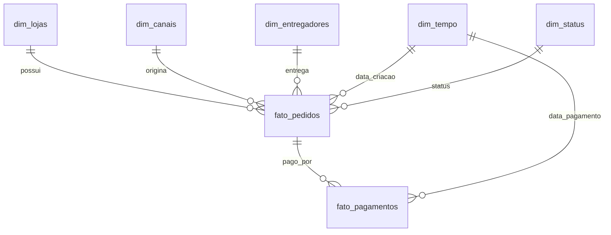

# Modelo Dimensional - DW & Data Marts

Este documento apresenta a proposta de modelagem dimensional para o Data Warehouse (`dw`) e a camada de entrega de negócios (`mart`) do Mini Data Mart Delivery Center.

A modelagem segue a metodologia **Star Schema (Esquema Estrela)** para facilitar as consultas analíticas e otimizar a performance de ferramentas de BI (como Power BI, Looker Studio ou Tableau).

---

## 1. Arquitetura do Data Warehouse

O banco de dados está dividido em três esquemas lógicos:
1. **`stg` (Staging)**: Tabelas espelho dos arquivos CSV, sem chaves primárias ou restrições, contendo dados brutos.
2. **`dw` (Data Warehouse)**: Tabelas Dimensão (`dim_`) e Fato (`fato_`) limpas, tipadas e com integridade referencial estabelecida.
3. **`mart` (Data Marts)**: Visões (Views) ou tabelas agregadas prontas para consumo das áreas de negócios (Financeiro, Logística, Comercial).

---

## 2. Desenho das Tabelas no Schema `dw`

### 2.1. Tabelas Dimensão

#### `dw.dim_lojas` (Desnormalizada de Lojas + Hubs)
Contém os dados cadastrais das lojas e seus respectivos Hubs integrados para simplificar a análise regional.
* `sk_loja` (SERIAL PRIMARY KEY - Surrogate Key)
* `store_id` (INT - ID original do sistema de origem)
* `store_name` (VARCHAR)
* `store_segment` (VARCHAR)
* `store_plan_price` (NUMERIC)
* `store_latitude` (DOUBLE PRECISION)
* `store_longitude` (DOUBLE PRECISION)
* `hub_id` (INT)
* `hub_name` (VARCHAR)
* `hub_city` (VARCHAR)
* `hub_state` (VARCHAR)

#### `dw.dim_entregadores`
Cadastro de entregadores ativos.
* `sk_entregador` (SERIAL PRIMARY KEY)
* `driver_id` (INT)
* `driver_modal` (VARCHAR) - *MOTOBOY, BIKER, etc.*
* `driver_type` (VARCHAR) - *FREELANCE, LOGISTIC OPERATOR*

#### `dw.dim_canais`
Canais de venda onde os pedidos foram realizados.
* `sk_canal` (SERIAL PRIMARY KEY)
* `channel_id` (INT)
* `channel_name` (VARCHAR)
* `channel_type` (VARCHAR) - *MARKETPLACE, OWN CHANNEL*

#### `dw.dim_status`
Dimensão *junk* para agrupar estados do pedido e da entrega.
* `sk_status` (SERIAL PRIMARY KEY)
* `order_status` (VARCHAR) - *DELIVERED, CANCELED, etc.*
* `delivery_status` (VARCHAR) - *DELIVERED, etc. (pode ser Nulo se não houve entrega)*

#### `dw.dim_tempo`
Tabela gerada para análise de séries temporais (Ano, Mês, Dia, Hora, Dia da Semana, etc.).
* `sk_tempo` (INT PRIMARY KEY) - *Formato YYYYMMDD ou YYYYMMDDHH*
* `data_completa` (TIMESTAMP)
* `ano` (INT)
* `mes` (INT)
* `nome_mes` (VARCHAR)
* `dia` (INT)
* `hora` (INT)
* `dia_semana` (VARCHAR)
* `eh_fim_semana` (BOOLEAN)

---

### 2.2. Tabelas Fato

#### `dw.fato_pedidos`
Registra cada transação de pedido única, suas métricas operacionais e financeiras.
* **Chaves (FKs para as Dimensões)**:
  * `sk_pedido` (SERIAL PRIMARY KEY)
  * `order_id` (INT - ID de Negócio)
  * `fk_loja` (INT REFERENCES `dw.dim_lojas`)
  * `fk_canal` (INT REFERENCES `dw.dim_canais`)
  * `fk_entregador` (INT REFERENCES `dw.dim_entregadores` - *pode ser nulo em cancelados*)
  * `fk_status` (INT REFERENCES `dw.dim_status`)
  * `fk_tempo_criacao` (INT REFERENCES `dw.dim_tempo`)
* **Métricas Financeiras**:
  * `valor_pedido` (NUMERIC(15,2)) - *order_amount*
  * `taxa_entrega` (NUMERIC(15,2)) - *order_delivery_fee*
  * `custo_entrega` (NUMERIC(15,2)) - *order_delivery_cost*
  * `lucro_entrega` (NUMERIC(15,2)) - *Calculado: taxa_entrega - custo_entrega*
* **Métricas Operacionais (Minutos)**:
  * `tempo_producao_minutos` (DOUBLE PRECISION)
  * `tempo_coleta_minutos` (DOUBLE PRECISION)
  * `tempo_transito_minutos` (DOUBLE PRECISION)
  * `tempo_ciclo_total_minutos` (DOUBLE PRECISION)

#### `dw.fato_pagamentos`
Como um pedido pode ter múltiplos métodos de pagamento, essa fato granular registra cada transação financeira realizada.
* `sk_pagamento` (SERIAL PRIMARY KEY)
* `payment_id` (INT)
* `fk_pedido` (INT REFERENCES `dw.fato_pedidos`)
* `fk_tempo_pagamento` (INT REFERENCES `dw.dim_tempo`)
* `metodo_pagamento` (VARCHAR) - *VOUCHER, ONLINE, DEBIT, etc.*
* `status_pagamento` (VARCHAR) - *PAID, etc.*
* `valor_pagamento` (NUMERIC(15,2)) - *payment_amount*
* `taxa_pagamento` (NUMERIC(15,2)) - *payment_fee*

---

## 3. Camada de Negócios (`mart`)

Na camada `mart`, criaremos views otimizadas para responder a perguntas de negócio sem a necessidade de joins complexos pelas ferramentas de visualização.

1. **`mart.vendas_lojas`**: 
   * Agrega faturamento total, ticket médio, quantidade de pedidos e taxa de cancelamento por Loja, Hub, Segmento e período de tempo.
2. **`mart.performance_logistica`**:
   * Focada em entregas. Calcula o tempo médio de trânsito, tempo de expedição, distância média percorrida e custo médio de entrega por Hub, Cidade, Tipo de Veículo (Modal) e Tipo de Entregador.
3. **`mart.financeiro_pagamentos`**:
   * Consolida a receita total, taxas pagas a operadoras de cartão/vouchers e distribui a preferência de métodos de pagamento por canal de vendas.
