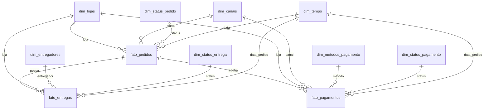

# Modelo Dimensional - DW & Data Marts

Este documento descreve a implementação dimensional do Data Warehouse (`dw`) e a proposta da camada de consumo (`mart`) do Mini Data Mart Delivery Center.

A modelagem utiliza uma constelação de fatos: pedidos, entregas e pagamentos compartilham dimensões conformadas. Essa separação preserva o grão de cada processo de negócio e evita duplicação de valores em consultas analíticas.

---

## 1. Arquitetura do Data Warehouse

O banco de dados está dividido em três schemas:

1. **`stg` (Staging)**: espelho dos CSVs, sem chaves ou regras rígidas, contendo dados brutos.
2. **`dw` (Data Warehouse)**: dimensões e fatos limpas, tipadas e relacionadas.
3. **`mart` (Data Marts)**: views analíticas prontas para consumo pelo Power BI.

Os grãos das tabelas fato são:

- `dw.fato_pedidos`: uma linha por pedido.
- `dw.fato_entregas`: uma linha por registro ou tentativa de entrega.
- `dw.fato_pagamentos`: uma linha por transação de pagamento.

O grão separado de entregas é necessário porque a origem possui pedidos com mais de uma entrega. Da mesma forma, um pedido pode possuir vários pagamentos.

---

## 2. Relacionamentos

```mermaid
erDiagram
    dim_lojas ||--o{ fato_pedidos : "loja"
    dim_canais ||--o{ fato_pedidos : "canal"
    dim_status_pedido ||--o{ fato_pedidos : "status"
    dim_tempo ||--o{ fato_pedidos : "data"

    fato_pedidos ||--o{ fato_entregas : "possui"
    dim_lojas ||--o{ fato_entregas : "loja"
    dim_entregadores ||--o{ fato_entregas : "entregador"
    dim_status_entrega ||--o{ fato_entregas : "status"
    dim_tempo ||--o{ fato_entregas : "data_pedido"

    fato_pedidos ||--o{ fato_pagamentos : "recebe"
    dim_lojas ||--o{ fato_pagamentos : "loja"
    dim_canais ||--o{ fato_pagamentos : "canal"
    dim_metodos_pagamento ||--o{ fato_pagamentos : "metodo"
    dim_status_pagamento ||--o{ fato_pagamentos : "status"
    dim_tempo ||--o{ fato_pagamentos : "data_pedido"
```

---

## 3. Dimensões

Todas as dimensões, com exceção de `dim_tempo`, utilizam uma surrogate key `BIGINT IDENTITY`. A chave natural da origem recebe uma restrição `UNIQUE`.

### 3.1. `dw.dim_lojas`

Uma linha por loja. Os dados do hub são desnormalizados para simplificar análises regionais.

Principais campos:

- `sk_loja`: surrogate key.
- `store_id`: identificador da origem.
- `store_name`, `store_segment`, `store_plan_price`.
- `store_latitude`, `store_longitude`.
- `hub_id`, `hub_name`, `hub_city`, `hub_state`.

### 3.2. `dw.dim_entregadores`

Uma linha por entregador.

- `sk_entregador`: surrogate key.
- `driver_id`: identificador da origem.
- `driver_modal`: modal utilizado, como `MOTOBOY` ou `BIKER`.
- `driver_type`: tipo de vínculo, como `FREELANCE`.

O `driver_id = -1` representa entregas cujo entregador não foi informado na origem. Isso permite manter a foreign key obrigatória sem descartar entregas.

### 3.3. `dw.dim_canais`

Uma linha por canal de venda.

- `sk_canal`: surrogate key.
- `channel_id`: identificador da origem.
- `channel_name`.
- `channel_type`: `MARKETPLACE` ou `OWN CHANNEL`.

### 3.4. Dimensões de status

Os status são separados pelo processo de negócio:

- `dw.dim_status_pedido`: status do pedido.
- `dw.dim_status_entrega`: status da entrega.
- `dw.dim_status_pagamento`: status da transação de pagamento.

Essa separação evita uma dimensão com combinações artificiais entre processos que possuem grãos diferentes.

### 3.5. `dw.dim_metodos_pagamento`

Uma linha por método de pagamento, como `ONLINE`, `VOUCHER`, `DEBIT` ou `CREDIT`.

### 3.6. `dw.dim_tempo`

Uma linha por dia, abrangendo todo o intervalo encontrado em `stg.orders`.

- `sk_tempo`: chave no formato `YYYYMMDD`.
- `data_completa`.
- `ano`, `semestre`, `trimestre`, `mes`, `nome_mes`, `dia`.
- `numero_dia_semana`, `nome_dia_semana`, `eh_fim_semana`.

Os timestamps completos permanecem em `fato_pedidos`, permitindo análises por hora sem transformar cada instante em uma linha da dimensão.

A chave temporal do pedido é derivada de `order_moment_created`. Esse timestamp completo é considerado canônico quando as colunas fragmentadas de ano, mês e dia da staging apresentam divergência.

---

## 4. Tabelas Fato

### 4.1. `dw.fato_pedidos`

Grão: uma linha por `order_id`.

Chaves:

- `fk_loja`.
- `fk_canal`.
- `fk_status_pedido`.
- `fk_tempo_criacao`.

Métricas financeiras:

- `valor_pedido`.
- `taxa_entrega`.
- `custo_entrega`.
- `valor_total_pedido`: coluna gerada como `valor_pedido + taxa_entrega`.
- `margem_entrega`: coluna gerada como `taxa_entrega - custo_entrega`.

Datas operacionais:

- criação, aceite, prontidão, coleta, expedição, saída para entrega, entrega e finalização.

Métricas operacionais:

- tempos de coleta, pausa, produção, caminhada, expedição, trânsito e ciclo total.

### 4.2. `dw.fato_entregas`

Grão: uma linha por `delivery_id`.

Chaves:

- `fk_pedido`.
- `fk_tempo_pedido`.
- `fk_loja`.
- `fk_entregador`.
- `fk_status_entrega`.

Campos analíticos:

- `numero_tentativa`.
- `eh_ultima_tentativa`.
- `distancia_entrega_metros`.

Os campos de tentativa deixam explícitos os pedidos que passaram por mais de uma entrega.

Como a origem não possui timestamp próprio da tentativa, `numero_tentativa` e `eh_ultima_tentativa` usam a ordem crescente de `delivery_id` como critério determinístico.

### 4.3. `dw.fato_pagamentos`

Grão: uma linha por `payment_id`.

Chaves:

- `fk_pedido`.
- `fk_tempo_pedido`.
- `fk_loja`.
- `fk_canal`.
- `fk_metodo_pagamento`.
- `fk_status_pagamento`.

Métricas:

- `valor_pagamento`.
- `taxa_pagamento`.
- `valor_liquido_pagamento`: coluna gerada como valor menos taxa.

O arquivo de pagamentos não possui uma data própria. Por isso, `fk_tempo_pedido` representa a data do pedido e não deve ser interpretada como data efetiva do pagamento.

---

## 5. Estratégia de carga

As dimensões utilizam SCD Tipo 1 com `INSERT ... ON CONFLICT DO UPDATE`. Quando um cadastro muda, seus atributos são atualizados e a surrogate key é preservada.

As fatos utilizam full-refresh:

1. A carga é iniciada dentro de uma transação.
2. As dimensões são atualizadas.
3. As três fatos são truncadas juntas.
4. Pedidos, entregas e pagamentos são recarregados.
5. As tabelas são analisadas pelo PostgreSQL.
6. A transação é confirmada.

Caso qualquer etapa falhe, a transação inteira é revertida.

---

## 6. Camada de negócios (`mart`)

A camada implementada contém:

1. **`mart.vw_pedidos_enriquecidos`**: uma linha por pedido.
2. **`mart.vw_entregas_enriquecidas`**: uma linha por entrega ou tentativa.
3. **`mart.vw_pagamentos_enriquecidos`**: uma linha por transação de pagamento.
4. **`mart.vw_kpis_vendas_diarios`**: pedidos, cancelamentos, ticket, valor transacionado e margem por dia, loja e canal.
5. **`mart.vw_performance_logistica`**: última tentativa, distância e tempos por dia, hub e perfil de entregador.
6. **`mart.vw_conciliacao_pagamentos`**: valor esperado versus pagamentos confirmados, com uma linha por pedido.
7. **`mart.vw_mix_pagamentos`**: participação dos métodos `PAID` por dia, hub e canal.
8. **`mart.vw_performance_lojas`**: desempenho mensal por loja.

As agregações de pedidos, entregas e pagamentos devem ser realizadas separadamente antes de serem combinadas. Fazer um join direto entre as três fatos pode multiplicar valores devido às relações 1:N.

As definições formais, filtros e limitações dos indicadores estão documentadas em [`docs/kpis.md`](kpis.md).
