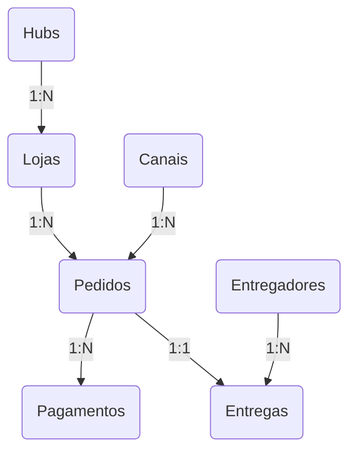

# Regras de Negócio - Mini Data Mart Delivery Center

Este documento descreve as regras de negócio operacionais, lógicas de relacionamento e validações identificadas a partir dos dados do Delivery Center.

---

## 1. Estrutura e Relacionamentos Principais

O ecossistema do Delivery Center é composto por pedidos que conectam canais de venda, lojas, hubs, pagamentos, entregas e entregadores.

### 1.1. Hubs e Lojas
* Cada **Loja** (`stg.stores`) está obrigatoriamente vinculada a um **Hub** (`stg.hubs`). Os hubs funcionam como centros de distribuição físicos onde as lojas físicas ou cozinhas compartilhadas estão localizadas.
* Um Hub atende a múltiplas Lojas (relacionamento 1:N).

### 1.2. Canais de Venda
* Cada **Pedido** (`stg.orders`) é originado em um **Canal de Venda** (`stg.channels`).
* Os canais são divididos em dois tipos (`channel_type`):
  * **OWN CHANNEL**: Canal próprio da loja (ex: aplicativo próprio, WhatsApp, telefone).
  * **MARKETPLACE**: Plataforma de terceiros (ex: Food Place, Shopping Place).

### 1.3. Pedidos e Pagamentos
* Um **Pedido** pode ter um ou mais **Pagamentos** associados (`stg.payments`). 
* Relacionamento é de **1:N** entre `stg.orders` e `stg.payments` através do `payment_order_id`. Isso ocorre porque um cliente pode dividir o pagamento do pedido (ex: parte em Voucher e parte em Cartão Online).

### 1.4. Pedidos, Entregas e Entregadores
* Um **Pedido** possui no máximo uma **Entrega** (`stg.deliveries`) vinculada através do `delivery_order_id` (relacionamento 1:1).
* Cada **Entrega** é realizada por um único **Entregador** (`stg.drivers`) através do `driver_id` (relacionamento 1:N).
* Os entregadores possuem diferentes modais (`driver_modal`: `MOTOBOY`, `BIKER`, etc.) e tipos de contrato (`driver_type`: `FREELANCE` ou `LOGISTIC OPERATOR`).

---

## 2. Regras Financeiras e Cálculos

### 2.1. Composição do Valor do Pedido
O valor total transacionado em um pedido é composto por:
$$\text{Valor Total} = \text{order\_amount} + \text{order\_delivery\_fee}$$

Onde:
* `order_amount`: Valor líquido dos produtos vendidos pela loja.
* `order_delivery_fee`: Taxa de entrega cobrada do cliente final.

### 2.2. Conciliação de Pagamentos
Para um pedido ser considerado financeiramente saudável e totalmente pago, a soma de seus pagamentos deve ser igual ao valor total do pedido:
$$\sum (\text{payment\_amount}) = \text{order\_amount} + \text{order\_delivery\_fee}$$

### 2.3. Custo de Entrega vs. Taxa de Entrega
* `order_delivery_fee`: É a receita de entrega (o que o cliente pagou pelo frete).
* `order_delivery_cost`: É o custo da entrega (o valor repassado ao entregador/operadora logística).
* **Margem da Entrega**: $\text{order\_delivery\_fee} - \text{order\_delivery\_cost}$. 
  * Se for positiva, o Delivery Center lucrou com o frete.
  * Se for negativa, a entrega foi subsidiada.

---

## 3. Fluxo de Tempo e Métricas Operacionais (SLA)

Os pedidos passam por várias etapas temporais registradas na tabela `stg.orders`:

1. **`order_moment_created`**: Pedido criado pelo cliente.
2. **`order_moment_accepted`**: Loja aceita o pedido e inicia a produção.
3. **`order_moment_ready`**: O pedido terminou de ser preparado e está aguardando coleta.
4. **`order_moment_collected`**: O entregador coletou o pedido na loja.
5. **`order_moment_in_expedition`**: Pedido entra na triagem/expedição do Hub.
6. **`order_moment_delivering`**: O entregador sai para a rota de entrega.
7. **`order_moment_delivered`**: O pedido é entregue ao cliente.
8. **`order_moment_finished`**: O ciclo do pedido é finalizado no sistema.

### 3.1. Definição das Métricas de Performance (SLA)
As colunas `order_metric_...` medem o tempo (em minutos) gasto em cada etapa do ciclo de vida:
* **Tempo de Produção (`order_metric_production_time`)**: Tempo entre o aceite da loja e o pedido ficar pronto (`ready` - `accepted`).
* **Tempo de Trânsito (`order_metric_transit_time`)**: Tempo que o entregador levou da saída do hub até a casa do cliente (`delivered` - `delivering`).
* **Tempo de Ciclo Total (`order_metric_cycle_time`)**: Tempo total desde a criação do pedido até a finalização do ciclo (`finished` - `created`).
