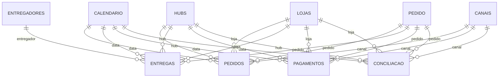

# Arquitetura do modelo Power BI

## Estratégia

O projeto usa modo **Import** sobre quatro views detalhadas e seguras contra fanout do schema `mart`. As dimensões são consultas `SELECT DISTINCT` derivadas dessas views. As quatro views agregadas permanecem como camada de conferência SQL e podem ser usadas futuramente como agregações gerenciadas.

Essa escolha mantém todos os filtros e o drill-through no mesmo modelo sem relacionar fatos entre si.

## Modelo estrela

Todas as relações são `1:*`, com filtro em sentido único da dimensão para a fato. Não há relações bidirecionais nem relações fato-fato.

O redesign de agosto de 2026 preservou integralmente essas 20 relações, os grãos e as fontes. As novas medidas de período anterior, variação, participação e contexto de tooltip não criam caminhos de filtro adicionais.

## Tabelas e fontes

| Tabela no modelo | Tipo/grão | Fonte PostgreSQL |
|---|---|---|
| `Calendário` | dimensão, um dia | `mart.vw_pedidos_enriquecidos` |
| `Hubs` | dimensão, um hub | `mart.vw_pedidos_enriquecidos` |
| `Lojas` | dimensão, uma loja | `mart.vw_pedidos_enriquecidos` |
| `Canais` | dimensão, um canal | `mart.vw_pedidos_enriquecidos` |
| `Entregadores` | dimensão, um entregador | `mart.vw_entregas_enriquecidas` |
| `Pedido` | dimensão degenerada, um pedido | `mart.vw_pedidos_enriquecidos` |
| `Pedidos` | fato, um pedido | `mart.vw_pedidos_enriquecidos` |
| `Entregas` | fato, uma tentativa | `mart.vw_entregas_enriquecidas` |
| `Pagamentos` | fato, uma transação | `mart.vw_pagamentos_enriquecidos` |
| `Conciliação` | fato, um pedido | `mart.vw_conciliacao_pagamentos` |
| `Métricas` | tabela calculada | `ROW("Controle", 1)` |

Views agregadas usadas para QA e reconciliação: `vw_kpis_vendas_diarios`, `vw_performance_logistica`, `vw_mix_pagamentos` e `vw_performance_lojas`.

## Parâmetros e credenciais

O modelo expõe dois parâmetros TMDL:

- `Servidor PostgreSQL`: `localhost:5432`;
- `Banco PostgreSQL`: `mini_datamart_delivery`.

Usuário e senha não ficam versionados. O Power BI Desktop solicita as credenciais na primeira atualização.

## Regras de segurança analítica

- Valores de pedido são calculados somente na fato `Pedidos`.
- Valores de pagamento são calculados somente na fato `Pagamentos`.
- Conciliação usa a view com uma linha por pedido.
- Percentuais são divisões de numeradores e denominadores no contexto atual, nunca médias de percentuais.
- Medidas logísticas consideram a última tentativa quando a regra de negócio exige um desfecho por pedido.
- Não há RLS porque o projeto não recebeu uma regra de acesso por usuário; ela deve ser definida antes da publicação organizacional.
- P90 é mantido como estatística descritiva; sem meta formal, o relatório não o chama de SLA nem classifica hubs como dentro/fora do SLA.
